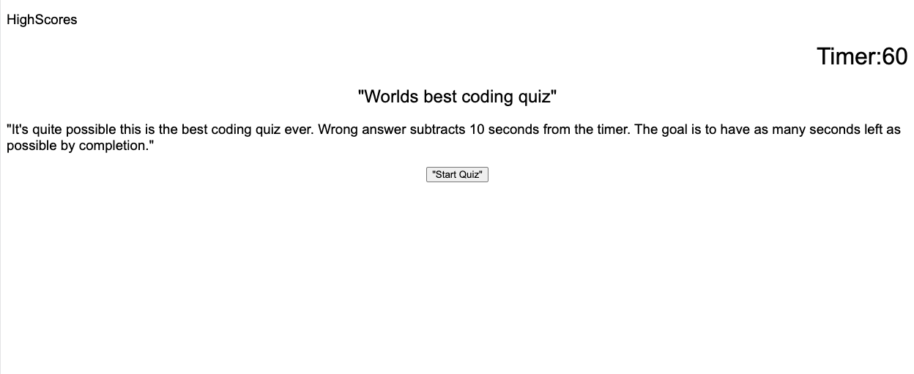

# codingQuiz
A timed coding quiz based on javascript. 

# Goal
The goal of this project was to create a timed coding quiz. The quiz is multiple choice, and each answer selection an event happens. Using the timer and many differnet javascript functions a user is able to cycle through question and save their initials to local storage at the end. 

# Application link
https://niccatania.github.io/codingQuiz/

# Screenshots

 
# Usage

If you would like to add or update to this code please contact me

